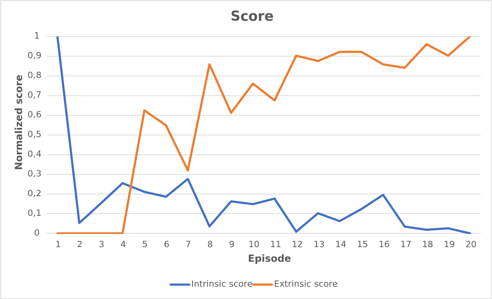
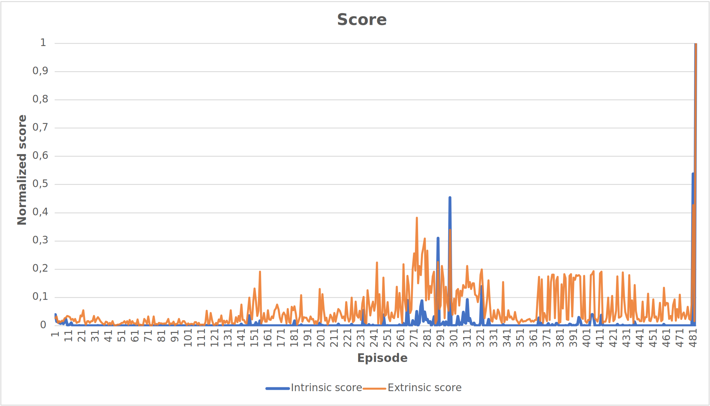
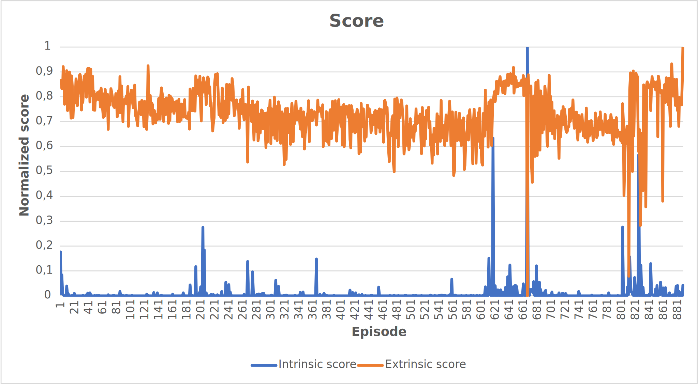
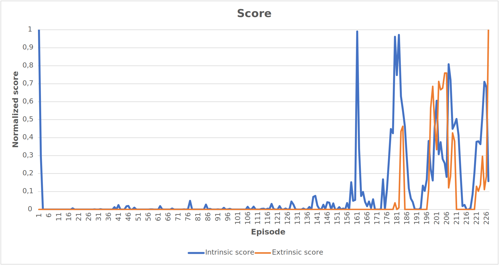

# Signal novelty detection as an intrinsic reward for robotics

Paper: [Signal Novelty Detection as an Intrinsic Reward for Robotics](https://doi.org/10.3390/s23083985)

## AutoEncoder Architecture
AutoEncoder is one of the deep neural network methods used to detect anomalies in the signals received from the sensors on the robot. The principle is to train on the previously observed states from the experience replay buffer (RB), while the prediction is done over the observed state. In this way, early detection of new previously unobserved states is possible, which will help the agent to explore the environment and try to access previously unvisited states in the agent's state space.

## Results
The results were obtained by the Dueling Deep Q Network (DQN) algorithm, which represented the agent. All tested tasks were learned without extrinsic reward from the environment using only this novelty intrinsic reward method.

* Acrobot-v1

* CartPole-v1

* LunarLander-v2

* MountainCar-v0

